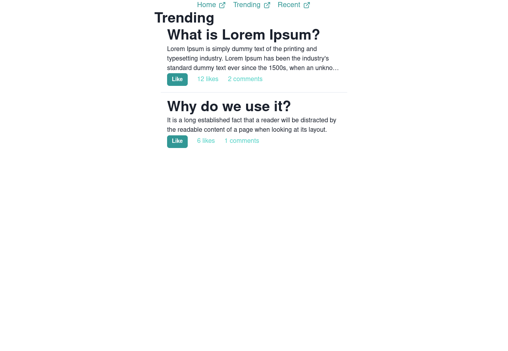

# Board application
I made this on a boring weekend so by this point its probably incomplete. This is supposed to be a board application where you can post threads and people can like, comment and like the comments.

## Features
Its very barebones, but it has a few cool features.

1. Likes and comments posted update in "real time". That accounts only for the client's comments and likes. To see other people's you need to reload the page at the moment. There is also no limitation to how many times you can like.

2. Sort by date or popularity (amount of likes, actually).

## How to build
I'm not sure why, but on my machine when trying to build the app it throws an error that has to do with redux. If you can fix this, good for you!

## How to run
Make sure to have the backend of the app running if you try to use it.

### Thats about it. I don't know what anymore to say :)